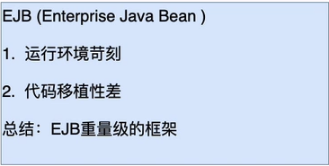
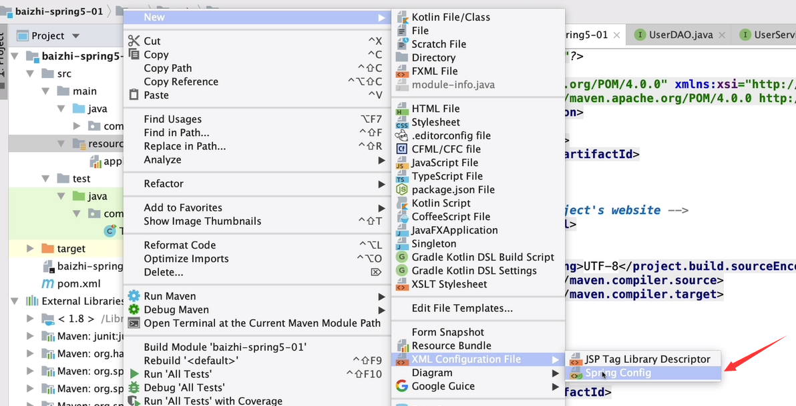
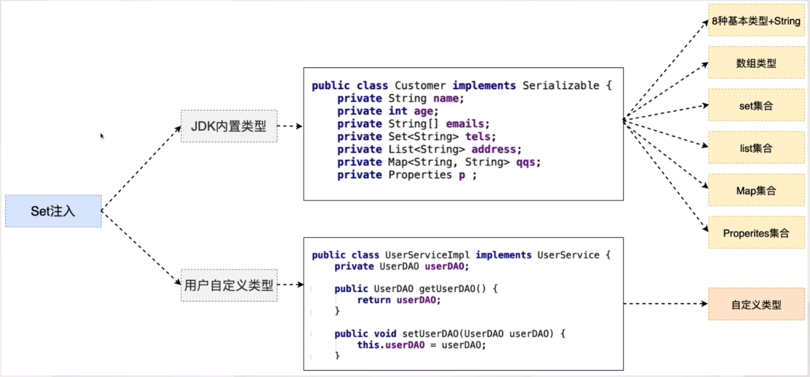

### 第一章 引言

#### 1.EJB存在的问题



#### 2.什么是Spring

```
1.Spring是一个轻量级的JavaEE解决方案，整合众多优秀的设计模式
```

- 轻量级

  ~~~markdown
  1. 对于运行环境是没有额外要求的
     开源 tomcat resion jetty
     收费 weblogic websphere
  2. 代码移植性
     不需要实现额外接口
  ~~~

- JavaEE的解决方案


- 整合设计模式

```markdown
1. 工厂
2. 代理
3. 模板
4. 策略
```

#### 3.设计模式

~~~ markdown
1. 广义概念
面向对象设计中，解决特定问题的经典代码
2. 狭义概念
GOF4人帮所定义的23种设计模式：工厂、适配器、装饰器、门面、代理、模板...
~~~

#### 4.工厂模式

##### 4.1 什么是工厂设计模式

~~~markdown
1. 概念：通过工厂类，创建对象
2. 好处：解耦合
   耦合：指的是代码间的强关联关系，一方的改变会影响到另一方
   问题：不利于代码维护
   简单理解：把接口的实现类，硬编码再程序中
   		   UserService userService = new UserServiceImpl();
~~~

##### 4.2 简单工厂的设计

>对象的创建方式：
>
>1. 直接调用构造方法 创建对象 UserService userService = new UserServiceImpl();
>
>2. 通过反射的形式创建对象 解耦合
>
>   Class clazz = Class.forName("com.xxx.xxx.UserServiceImpl");
>
>   UserService userService  = (UserService)clazz.newInstance();

```java
package com.baizhiedu.basic;

import java.io.IOException;
import java.io.InputStream;
import java.util.Properties;

public class BeanFactory {
    private static Properties env = new Properties();
    
    static{
        try {
            //第一步 获得IO输入流
            InputStream inputStream = BeanFactory.class.getResourceAsStream("/applicationContext.properties");
            //第二步 文件内容 封装 Properties集合中 key = userService value = com.baizhixx.UserServiceImpl
            env.load(inputStream);

            inputStream.close();
        } catch (IOException e) {
            e.printStackTrace();
        }

    }
    
    /*
	   对象的创建方式：
	       1. 直接调用构造方法 创建对象  UserService userService = new UserServiceImpl();
	       2. 通过反射的形式 创建对象 解耦合
	       Class clazz = Class.forName("com.baizhiedu.basic.UserServiceImpl");
	       UserService userService = (UserService)clazz.newInstance();
     */

    public static UserService getUserService() {
        UserService userService = null;
        try {
            //com.baizhiedu.basic.UserServiceImpl
            Class clazz = Class.forName(env.getProperty("userService"));
            userService = (UserService) clazz.newInstance();
        } catch (ClassNotFoundException e) {
            e.printStackTrace();
        } catch (InstantiationException e) {
            e.printStackTrace();
        } catch (IllegalAccessException e) {
            e.printStackTrace();
        }
        return userService;
    }

    public static UserDAO getUserDAO(){
        UserDAO userDAO = null;
        try {
            Class clazz = Class.forName(env.getProperty("userDAO"));
            userDAO = (UserDAO) clazz.newInstance();
        } catch (ClassNotFoundException e) {
            e.printStackTrace();
        } catch (InstantiationException e) {
            e.printStackTrace();
        } catch (IllegalAccessException e) {
            e.printStackTrace();
        }
        return userDAO;
    }
}
```

 配置文件 applicationContext.properties： 

```xml
# Properties 集合 存储 Properties文件的内容
# 特殊Map key=String value=String
# Properties [userService = com.baizhiedu.xxx.UserServiceImpl]
# Properties.getProperty("userService")

userService = com.baizhiedu.basic.UserServiceImpl
userDAO = com.baizhiedu.basic.UserDAOImpl
```

##### 4.3 通用工厂的设计

- 问题

```markdown
简单工厂会存在大量的代码冗余
```


- 通用工厂的代码

```java
package com.baizhiedu.basic;

import java.io.IOException;
import java.io.InputStream;
import java.util.Properties;

public class BeanFactory {
    private static Properties env = new Properties();
    static{
        try {
            //第一步 获得IO输入流
            InputStream inputStream = BeanFactory.class.getResourceAsStream("/applicationContext.properties");
            //第二步 文件内容 封装 Properties集合中 key = userService value = com.baizhixx.UserServiceImpl
            env.load(inputStream);

            inputStream.close();
        } catch (IOException e) {
            e.printStackTrace();
        }
    }
    
     /*
      key 小配置文件中的key [userDAO,userService]
      */
     public static Object getBean(String key){
         Object ret = null;
         try {
             Class clazz = Class.forName(env.getProperty(key));
             ret = clazz.newInstance();
         } catch (Exception e) {
            e.printStackTrace();
         }
         return ret;
     }
}
```

##### 4.4 通用工厂的使用方式

```markdown
1. 定义类型（类）
2. 通过配置文件的配置来告知工厂(applicationContext.properties)
   key = value
3. 通过工厂来获得类的对象
   Object ret = BeanFactory.getBean("key")
```

#### 5.总结

```markdown
Spring的本质：工厂 ApplicationContext 配置文件 applicationContext.xml
```

### 第二章 第一个Spring程序

#### 1.软件版本

```markdown
1. JDK1.8+
2. Maven3.5+
3. IDEA 2018+
4. SpringFramework 5.1.4
```

#### 2.环境搭建

- Spring的jar包

  ```markdown
  <!-- https://mvnrepository.com/artifact/org.springframework/spring-context -->
  <dependency>
      <groupId>org.springframework</groupId>
      <artifactId>spring-context</artifactId>
      <version>5.1.14.RELEASE</version>
  </dependency>
  ```

- Spring的配置文件

```markdown
1. 配置文件的放置位置：任意位置 没有硬性要求
2. 配置文件的命名： 没有硬性要求 建议：applicationContext.xml

思考：日后应用Spring框架时，需要进行配置文件路径的设置。
```



#### 3.Spring的核心API

- ApplicationContext

  ```markdown
  作用：Spring提供的ApplicationContext这个工厂，用于对象的创建
  好处：解耦合
  ```

  - ApplicationContext接口类型

    ```markdown
    接⼝：屏蔽实现的差异
    ⾮web环境 ：ClassPathXmlApplicationContext(main junit 不启动服务器) 
    web环境 ：XmlWebApplicationContext（启动服务器）
    ```

    

  - 重量级资源

    ```markdown
    ApplicationContext工厂的对象占用大量内存
    不会频繁的创建对象： 一个应用只会创建一个工厂对象
    ApplicationContext工厂：一定是线程安全的（多线程并发访问）
    ```
```
    


#### 4.程序开发

​```markdown
1. 创建类型
2. 配置文件的配置 applicationContext.xml
3. 通过工厂类，获得对象
   ApplicationContext
   		Junit中 |- ClassPathXmlApplicationContext
   ApplicationContext ctx = new ClassPathXmlApplicationContent("applicationContext.xml");
   Person person = (Person)ctx.getBean("person"); // 键值对的方式来获取
```


#### 5.细节分析

- 名词解释

  ```markdown
  Spring ⼯⼚创建的对象，叫做 bean 或者 组件(componet)；
  ```

- Spring工厂的一些方法

```java
// getBean：传入 id值 和 类名 获取对象，不需要强制类型转换。
// 通过这种⽅式获得对象，就不需要强制类型转换
Person person = ctx.getBean("person", Person.class);
System.out.println("person = " + person);

// getBean：只指定类名，Spring 的配置文件中只能有一个 bean 是这个类型。
// 使用这种方式的话, 当前Spring的配置文件中 只能有一个bean class是Person类型
Person person = ctx.getBean(Person.class);
System.out.println("person = " + person);

// getBeanDefinitionNames：获取 Spring 配置文件中所有的 bean 标签的 id 值。
// 获取的是Spring工厂配置文件中所有bean标签的id值  person person1
String[] beanDefinitionNames = ctx.getBeanDefinitionNames();
for (String beanDefinitionName : beanDefinitionNames) {
	System.out.println("beanDefinitionName = " + beanDefinitionName);
}

// getBeanNamesForType：根据类型获得 Spring 配置文件中对应的 id 值。
// 根据类型获得Spring配置文件中对应的id值
String[] beanNamesForType = ctx.getBeanNamesForType(Person.class);
for (String id : beanNamesForType) {
	System.out.println("id = " + id);
}

// containsBeanDefinition：用于判断是否存在指定 id 值的 bean，不能判断 name 值
// 用于判断是否存在指定id值的bean,不能判断name值
if (ctx.containsBeanDefinition("person")) {
	System.out.println(true);
} else {
	System.out.println(false);
}

// containsBean：用于判断是否存在指定 id 值的 bean，也可以判断 name 值。
// 用于判断是否存在指定id值的bean,也可以判断name值
if (ctx.containsBean("person")) {
	System.out.println(true);
} else {
	System.out.println(false);
}
```

- 配置文件中需要注意的细节

  ```markdown
  1. 只配置class属性
  <bean class="Person">
a) 上述这种配置 有没有id值？ 答案：有，并且自动生成为Person#0
  b) 应用场景：如果这个bean只需要使用一次，那么就可以省略id值
  		   如果这个bean会使用多次，或者被其他 bean 引⽤则需要设置 id 值； 
  		   
  2. name属性
  作⽤：⽤于在 Spring 的配置⽂件中，为 bean 对象定义别名（小名）
  相同：
   	1.ctx.getBean("id") 或 ctx.getBean("name") 都可以获取对象；
      2.<bean id="person" class="Person"/>
        在定义方面等效于
        <bean name="person" class="Person"/>；
  区别：
  	1. 别名可以定义多个，但是id属性只能有一个值；（别名：<bean name="person,p1,p2"/>）
  	2. XML的id属性的值，命名要求：必须要以字母开头，可以包含字母、数字、下划线、连字符；不能以特殊字符开头/person；
  	   name属性的值，命名没有要求，可以设置成 /person的格式；
  	   name属性会应用在特殊命名的场景下：/person；
  	   
  	   XML发展到了今天：ID属性的限制已经不存在，/person也可以。
  	3. 代码
  	   containsBeanDefinition不能通过别名name来判断
  	   containsBean可以通过别名name来判断
  	   
  	   // 用于判断是否存在指定id值的bean,不能判断name值
          if (ctx.containsBeanDefinition("person")) {
              System.out.println(true);
          } else {
              System.out.println(false);
          }
          // 用于判断是否存在指定id值的bean,也可以判断name值
          if (ctx.containsBean("person")) {
              System.out.println(true);
          } else {
              System.out.println(false);
          }
  	   
  ```
  


#### 6.Spring工厂的底层实现原理（简易版）

**Spring工厂是可以调用对象私有的构造方法来创建对象，因为底层都是通过反射实现的**


#### 7.思考

```markdown
问题：未来在开发过程中，是不是所有的对象，都会交给 Spring ⼯⼚来创建呢？ 
回答：理论上是的，但是有特例 ：实体对象(entity) 是不会交给Spring创建，它由持久层框架进⾏创建。
```


### 第三章、Spring5.x与日志框架的整合

```markdown
Spring与日志框架进行整合，日志框架就可以在控制台中，输出Spring框架运行过程中的一些重要信息。
好处:便于了解Spring框架的运行过程，利于程序的调试。
```

- Spring如何整合日志框架

  ```markdown
  默认
  	Spring1.2.3早期都是与commons-logging.jar
  	Spring5.x默认整合的日志框架是 logback或者log4j2
  
  Spring5.x整合log4j
  	1. 引入log4j jar包
  	2. 引入log4.properties配置文件
  ```

  - pom

    ```xml
    // 日志门面，取消spring默认的日志，让Spring来采用log4j
    <dependency>
        <groupId>org.slf4j</groupId>
        <artifactId>slf4j-log4j12</artifactId>
        <version>1.7.25</version>
    </dependency>
    <dependency>
        <groupId>log4j</groupId>
        <artifactId>log4j</artifactId>
        <version>1.2.17</version>
    </dependency>
    ```

  - log4j.properties

    ```markdown
    # resources 文件夹根目录下
    ### 配置根
    log4j.rootLogger = debug,console
    
    ### 日志输出到控制台显示
    
    log4j.appender.console=org.apache.log4j.ConsoleAppender
    log4j.appender.console.Target=System.out
    log4j.appender.console.layout=org.apache.log4j.PatternLayout
    log4j.appender.console.layout.ConversionPattern=%d{yyyy-MM-dd HH:mm:ss} %-5p %c{1}:%L - %m%n
    ```

    


### 第四章、注入（injection）

#### 1.什么是注入

```markdown
通过Spring工厂及配置文件，为所创建对象的成员变量赋值
```

##### 1.1 为什么需要注入

**通过编码的方式，为成员变量进行赋值，存在耦合**


##### 1.2 如何进行注入[开发步骤]

- 类的成员变量提供set get方法；

- 配置Spring的配置文件；

  ```xml
  <bean id="Person" class="com.Person">
  	<property name="id">
          <value>10</value>
      </property>
      <property name="name">
          <value>heywecome</value>
      </property>
  </bean>
  ```

##### 1.3 注入好处

```markdown
解耦合
```

#### 2. Spring注入的原理分析(简易版)

```markdown
<bean>相当于新建一个对象；
<property>相当于set方法赋值。
```

**Spring会通过底层调用对象属性对应的set方法，完成成员变量的赋值，这种方法我们也称之为set注入**


### 第五章、set方法详解

**set注入的类型**



~~~markdown
针对于不同类型的成员变量，在<property标签中，需要嵌套其他标签:
<property>
...
</property>
~~~


#### 1. JDK内置类型

##### 1.1 String+8种基本类型

~~~markdown
<value>hwk</value>
~~~

##### 1.2 数组

~~~markdown
<list>
	<value>kangkang</value>
	<value>heywecome</value>
	<value>hehe</value>
</list>
~~~

##### 1.3 Set集合

~~~xml
<set>
	<value>111111</value>
    <value>132111</value>
    <value>144111</value>
</set>

如果set里面没有指定类型，那么里面的value可以存储多个类型的数据
<set>
	<ref bean=""></ref>
    <set></set>
    <value>313213</value>
</set>
~~~

##### 1.4 List集合

~~~xml
<list>
	<value>eran</value>
    <value>nantong</value>
</list>

<list>
	<ref bean=""></ref>
    <set></set>
    <value>313213</value>
</list>
~~~

##### 1.5 Map

~~~xml
注意： map -- 一个键值对包含在一个entry里面 -- key有特定的标签 <key></key>
					  					 值根据对应类型选择类型的标签
<map>
    <entry>
        <key><value>kangkang</value></key>
        <value>21</value>
    </entry>
    <entry>
        <key><value>xiaohe</value></key>
        <ref bean=""></ref>
    </entry>
</map>
~~~

##### 1.6 Properties

~~~markdown
Properties类型，它是一个特殊的Map，它的Key是String类型，value也是String类型的。
每一个pro都是一个键值对
~~~

~~~xml
<pros>
	<pro key="key1">value1</pro>
    <pro key="key2">value2</pro>
</pros>
~~~

##### 1.7 复杂的JDK类型(Date)

~~~markdown
需要程序员自定义类型转化器处理。
~~~

#### 2. 用户自定义类型

##### 2.1 第一种方式

- 为成员变量提供set get方法

- 配置文件中进行注入(赋值)

  ~~~xml
  <bean id="userService" class="xxx.UserServiceImpl">
  	<property name="userDao">
      	<bean class="xxx.UserDaoImpl"></bean>
      </property>
  </bean>
  ~~~

##### 2.2 第二种方式

- 第一种方式存在的问题

  ~~~markdown
  1. 配置文件代码冗余
  2. 被注入的对象(UserDao)，多次创建，浪费(JVM)内存资源
  ~~~

- 为成员变量提供set get方法

- 配置文件中进行配置

  ~~~xml
  <bean id="userDAO" class="xxx.UserDAOImpl">
  </bean>
  
  <bean id="userService" class="xxx.UserServiceImpl">
      <!-- property中的name为UserServiceImpl中的成员变量名 -->
  	<property name="userDAO">
          <!-- ref的userDao则是上面定义的bean -->
      	<ref bean="userDAO"/>
      </property>
  </bean>
  
  # Spring4.x废除了 <ref local=""/> 基本等效于 <ref bean=""/>
  ~~~

  

#### 3. Set注入的简化写法

##### 3.1 基于属性简化

~~~xml
JDK类型注入
<property name="name">
	<value>kangkang</value>
</property>

简化之后
<property name="name" value="kangkang"></property>
注意：
	value属性 只能简化 8种基本类型+String 注入标签

用户自定义类型
<property name="userDAO">
	<ref bean="userDAO"/>
</property>
简化：
<property name="userDAO" ref="userDAO"/>
~~~

##### 3.2 基于p命名空间简化

~~~xml
JDK类型注入
<bean id="person" class="xxx.Person">
    <property name="name">
        <value>kangkang</value>
    </property>
</bean>

简化之后
<bean id="" name="" p:name="suns"/>
注意：
	只能简化 8种基本类型+String 注入标签

用户自定义类型
<bean id="userService" class="xxx.UserServiceImpl">
    <property name="userDAO">
        <ref bean="userDAO"/>
    </property>
</bean>

简化：
<bean id="userService" class="xxx.UserServiceImpl" p:userDAO-ref="userDAO"/>
~~~

