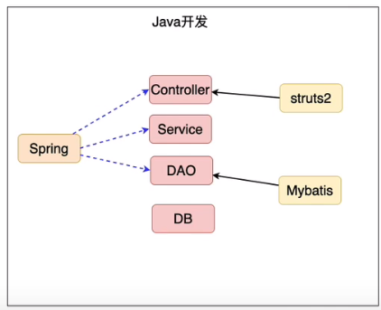
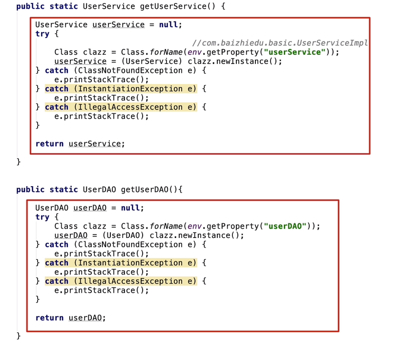
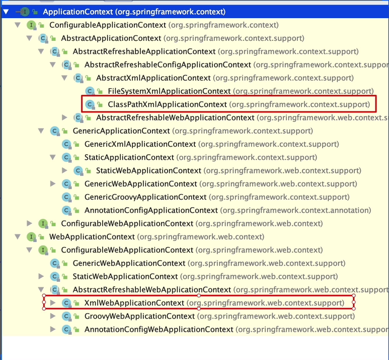

### 第一章 引言

#### 1.EJB存在的问题


#### 2.什么是Spring

```
1.Spring是一个轻量级的JavaEE解决方案，整合众多优秀的设计模式
```

- 轻量级

  ~~~markdown
  1. 对于运行环境是没有额外要求的
     开源 tomcat resion jetty
     收费 weblogic websphere
  2. 代码移植性
     不需要实现额外接口
  ~~~

- JavaEE的解决方案



- 整合设计模式

```markdown
1. 工厂
2. 代理
3. 模板
4. 策略
```

#### 3.设计模式

~~~ markdown
1. 广义概念
面向对象设计中，解决特定问题的经典代码
2. 狭义概念
GOF4人帮所定义的23种设计模式：工厂、适配器、装饰器、门面、代理、模板...
~~~

#### 4.工厂模式

##### 4.1 什么是工厂设计模式

~~~markdown
1. 概念：通过工厂类，创建对象
2. 好处：解耦合
   耦合：指的是代码间的强关联关系，一方的改变会影响到另一方
   问题：不利于代码维护
   简单理解：把接口的实现类，硬编码再程序中
   		   UserService userService = new UserServiceImpl();
~~~

##### 4.2 简单工厂的设计

>对象的创建方式：
>
>1. 直接调用构造方法 创建对象 UserService userService = new UserServiceImpl();
>
>2. 通过反射的形式创建对象 解耦合
>
>   Class clazz = Class.forName("com.xxx.xxx.UserServiceImpl");
>
>   UserService userService  = (UserService)clazz.newInstance();

```java
package com.baizhiedu.basic;

import java.io.IOException;
import java.io.InputStream;
import java.util.Properties;

public class BeanFactory {
    private static Properties env = new Properties();
    
    static{
        try {
            //第一步 获得IO输入流
            InputStream inputStream = BeanFactory.class.getResourceAsStream("/applicationContext.properties");
            //第二步 文件内容 封装 Properties集合中 key = userService value = com.baizhixx.UserServiceImpl
            env.load(inputStream);

            inputStream.close();
        } catch (IOException e) {
            e.printStackTrace();
        }

    }
    
    /*
	   对象的创建方式：
	       1. 直接调用构造方法 创建对象  UserService userService = new UserServiceImpl();
	       2. 通过反射的形式 创建对象 解耦合
	       Class clazz = Class.forName("com.baizhiedu.basic.UserServiceImpl");
	       UserService userService = (UserService)clazz.newInstance();
     */

    public static UserService getUserService() {
        UserService userService = null;
        try {
            //com.baizhiedu.basic.UserServiceImpl
            Class clazz = Class.forName(env.getProperty("userService"));
            userService = (UserService) clazz.newInstance();
        } catch (ClassNotFoundException e) {
            e.printStackTrace();
        } catch (InstantiationException e) {
            e.printStackTrace();
        } catch (IllegalAccessException e) {
            e.printStackTrace();
        }
        return userService;
    }

    public static UserDAO getUserDAO(){
        UserDAO userDAO = null;
        try {
            Class clazz = Class.forName(env.getProperty("userDAO"));
            userDAO = (UserDAO) clazz.newInstance();
        } catch (ClassNotFoundException e) {
            e.printStackTrace();
        } catch (InstantiationException e) {
            e.printStackTrace();
        } catch (IllegalAccessException e) {
            e.printStackTrace();
        }
        return userDAO;
    }
}
```

 配置文件 applicationContext.properties： 

```xml
# Properties 集合 存储 Properties文件的内容
# 特殊Map key=String value=String
# Properties [userService = com.baizhiedu.xxx.UserServiceImpl]
# Properties.getProperty("userService")

userService = com.baizhiedu.basic.UserServiceImpl
userDAO = com.baizhiedu.basic.UserDAOImpl
```

##### 4.3 通用工厂的设计

- 问题

```markdown
简单工厂会存在大量的代码冗余
```



- 通用工厂的代码

```java
package com.baizhiedu.basic;

import java.io.IOException;
import java.io.InputStream;
import java.util.Properties;

public class BeanFactory {
    private static Properties env = new Properties();
    static{
        try {
            //第一步 获得IO输入流
            InputStream inputStream = BeanFactory.class.getResourceAsStream("/applicationContext.properties");
            //第二步 文件内容 封装 Properties集合中 key = userService value = com.baizhixx.UserServiceImpl
            env.load(inputStream);

            inputStream.close();
        } catch (IOException e) {
            e.printStackTrace();
        }
    }
    
     /*
      key 小配置文件中的key [userDAO,userService]
      */
     public static Object getBean(String key){
         Object ret = null;
         try {
             Class clazz = Class.forName(env.getProperty(key));
             ret = clazz.newInstance();
         } catch (Exception e) {
            e.printStackTrace();
         }
         return ret;
     }
}
```

##### 4.4 通用工厂的使用方式

```markdown
1. 定义类型（类）
2. 通过配置文件的配置来告知工厂(applicationContext.properties)
   key = value
3. 通过工厂来获得类的对象
   Object ret = BeanFactory.getBean("key")
```

#### 5.总结

```markdown
Spring的本质：工厂 ApplicationContext 配置文件 applicationContext.xml
```

### 第二章 第一个Spring程序

#### 1.软件版本

```markdown
1. JDK1.8+
2. Maven3.5+
3. IDEA 2018+
4. SpringFramework 5.1.4
```

#### 2.环境搭建

- Spring的jar包

  ```markdown
  <!-- https://mvnrepository.com/artifact/org.springframework/spring-context -->
  <dependency>
      <groupId>org.springframework</groupId>
      <artifactId>spring-context</artifactId>
      <version>5.1.14.RELEASE</version>
  </dependency>
  ```

- Spring的配置文件

```markdown
1. 配置文件的放置位置：任意位置 没有硬性要求
2. 配置文件的命名： 没有硬性要求 建议：applicationContext.xml

思考：日后应用Spring框架时，需要进行配置文件路径的设置。
```


#### 3.Spring的核心API

- ApplicationContext

  ```markdown
  作用：Spring提供的ApplicationContext这个工厂，用于对象的创建
  好处：解耦合
  ```

  - ApplicationContext接口类型

    ```markdown
    接⼝：屏蔽实现的差异
    ⾮web环境 ：ClassPathXmlApplicationContext(main junit 不启动服务器) 
    web环境 ：XmlWebApplicationContext（启动服务器）
    ```

    

  - 重量级资源

    ```markdown
    ApplicationContext工厂的对象占用大量内存
    不会频繁的创建对象： 一个应用只会创建一个工厂对象
    ```

    